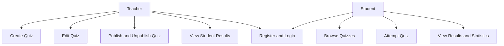
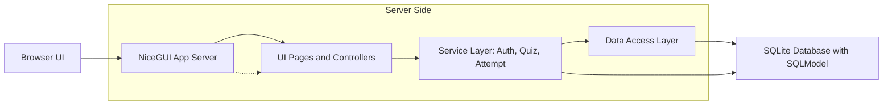

# 🎓 LearnLoop – Quiz Platform (Browser App)

---

LearnLoop is a browser-based quiz platform that allows teachers to create and manage quizzes, while students can solve them and track their progress.

It aims to:

- Cover the full process from **requirements analysis to implementation**
- Apply advanced **Python** concepts in a web-based application
- Demonstrate **data validation**, layered architecture, and ORM usage
- Produce clean, maintainable, and well-tested code
- Support **teamwork and professional documentation**
---
## 📑 Table of Contents

- [Application Requirements](#-application-requirements)
- [User Stories](#-user-stories)
- [Use Cases](#-use-cases)
- [App Screenshots](#-app-screenshots)
- [Architecture](#-architecture)
- [Database and ORM](#-database-and-orm)
- [Project Requirements](#-project-requirements)
- [Implementation](#-implementation)
- [Repository Structure](#-repository-structure)
- [How to Run](#-how-to-run)
- [Testing](#-testing)
- [Team & Contributions](#-team--contributions)
- [License](#-license)
---

## 📝 Application Requirements

### Problem

In educational settings, creating and distributing quizzes is often time-consuming and results are hard to track. Teachers need a simple tool to create quizzes with different question types, and students need a clean interface to solve them and see their results.


### Scenario

The application allows users to:

- Register and log in as either a **teacher** or a **student**
- Teachers can create, edit, publish, unpublish, and delete quizzes
- Teachers can view detailed results for each student per question
- Students can browse available quizzes and attempt them
- Students can review their results with a detailed per-question breakdown
- Students can track their overall statistics and history

---

## 📖 User Stories

### 1. Register and Login
**As a user, I want to register with a username, email, password, and role (teacher or student) so I can access the platform.**

- **Inputs:** username, email, password, role
- **Outputs:** new user account, redirect to dashboard

---

### 2. Create a Quiz (Teacher)
**As a teacher, I want to create a quiz with a title, description, and questions so my students can attempt it.**

- **Inputs:** title (`str`), description (`str`), questions with type and answer options
- **Outputs:** saved quiz (draft), visible in dashboard

---

### 3. Publish / Unpublish a Quiz (Teacher)
**As a teacher, I want to publish a quiz so students can see it, or set it back to draft if needed.**

- **Inputs:** quiz ID (`int`), action (`publish | unpublish`)
- **Outputs:** updated quiz status

---

### 4. View Student Results (Teacher)
**As a teacher, I want to see detailed results per student, including which questions were answered correctly or incorrectly.**

- **Inputs:** quiz ID (`int`)
- **Outputs:** list of attempts with per-question breakdown

---

### 5. Solve a Quiz (Student)
**As a student, I want to answer all questions in a quiz and submit my answers to get a score.**

- **Inputs:** selected answer options per question
- **Outputs:** score, percentage, correct/wrong count

---

### 6. View My Statistics (Student)
**As a student, I want to see all my past quiz attempts with scores and percentages so I can track my progress.**

- **Inputs:** none
- **Outputs:** list of attempts (`list[QuizAttempt]`), average, best result

---

## 🧩 Use Cases

### Main Use Cases
- Register / Login (Teacher & Student)
- Create Quiz (Teacher)
- Edit / Delete Quiz (Teacher)
- Publish / Unpublish Quiz (Teacher)
- View Student Results (Teacher)
- Browse Available Quizzes (Student)
- Solve Quiz (Student)
- View Results & Statistics (Student)

### Actors
- Teacher
- Student

### Use Case Diagram

The following Use Case Diagram shows the main actors and their primary interactions with the system.


---

## 🧱 App Screenshots

The UI from LearnLoop focuses on a clean, browser-friendly learning flow and the main pages used by teachers and students.

### Login / Registration Page
The screenshot below represents the login / registration page and introduces the application entry flow.


### Teacher Dashboard
This page shows quiz management actions, published and draft quizzes, and the main controls teachers need at a glance.


### Quiz Creation and Editing
These forms allow teachers to build new quizzes or update existing ones with questions, answer options, and status changes.


### Student Dashboard
This page presents available quizzes for students and gives them a simple starting point for browsing and attempting quizzes.


### Quiz Solving View
This screen guides students through one question at a time so the answering flow stays clear and focused.


### Results and Statistics
These pages summarize quiz attempts, scores, and progress so students can review their performance after submitting a quiz.


### Profile Page
This page gives users the opportunity to change their password.


### Main Screens
- Login / Registration page
- Teacher dashboard with quiz management actions
- Quiz creation and editing forms
- Student dashboard with available quizzes
- Quiz solving view with one question per step
- Results and statistics pages
- Profile page for password changes

### Design Goal
The design emphasizes simple navigation, clear status information, and a colorful layout that works well in a browser-based classroom setting.


---

## 🏛️ Architecture

### Layers
- **UI:** NiceGUI (browser-based interface)
- **Application logic:** Services and page controllers
- **Persistence:** SQLite + SQLModel ORM + Data Access (DAO)

### Design Decisions
- Layered MVC structure (Model–View–Controller)
- Clear separation of concerns between UI, services, and data access
- Business logic (scoring, authentication) independent of UI
- All scores stored as whole integers — no partial credit

### Design Patterns Used
- **Layered Architecture / MVC:** The application separates UI pages, service classes, and database models into distinct layers. This makes the codebase easier to understand, test, and extend.
- **Facade Pattern:** The `Database` class encapsulates all technical details of engine creation, schema initialisation, and seeding. The rest of the application only calls `db.get_session()`.
- **Service Layer:** `AuthService`, `QuizService`, and `AttemptService` encapsulate all business logic. Pages call services rather than querying the database directly.

### Architecture Diagram

The following diagram shows the main components and their relationships: browser, NiceGUI server, service layer, data access layer, and database.



---

## 🗄️ Database and ORM

The application uses **SQLModel** to map domain objects to a SQLite database.

### Entities
- `User` — teachers and students
- `Quiz` — quizzes created by teachers
- `Question` — questions belonging to a quiz
- `AnswerOption` — answer choices for each question
- `QuizAttempt` — one attempt by a student on a quiz
- `StudentAnswer` — the answer a student gave for one question
 - `StudentAnswerSelection` — links a `StudentAnswer` to one or more `AnswerOption` rows (used for multiple-choice answers)

### Relationships
- One `User` (teacher) → many `Quiz`
- One `Quiz` → many `Question`
- One `Question` → many `AnswerOption`
- One `User` (student) → many `QuizAttempt`
- One `QuizAttempt` → many `StudentAnswer`
- One `StudentAnswer` → many `StudentAnswerSelection` (one student answer can reference multiple selected answer options)
- One `AnswerOption` → many `StudentAnswerSelection` (an answer option can be selected in many student answers)

### Question Types

| Type | Key | Description |
|------|-----|-------------|
| Single Choice | `single` | One correct answer from 4 options |
| Multiple Choice | `multiple` | Multiple correct answers — all right answers must be selected to get the full point |
| True / False | `truefalse` | True or False — one correct answer from 2 options |

### ER-Diagram


### Class diagram


---

## ✅ Project Requirements

### 1. Browser-based App (NiceGUI)

The application runs entirely in the browser. All UI components (`ui.button`, `ui.input`, `ui.card`, etc.) are rendered server-side via NiceGUI. The browser acts as a thin client — no business logic runs in the browser.

Key pages:
- Login & Registration
- Teacher Dashboard (quiz management, search, publish/delete)
- Quiz Creator and Editor
- Student Dashboard (available quizzes, search)
- Quiz View (question-by-question)
- Results Page (per-question breakdown)
- Statistics Page
- Profile (password change)

### 2. Data Validation

The application validates all user input:

- Empty title or missing questions → quiz cannot be saved
- Password must be at least 6 characters on registration
- All questions must be answered before quiz submission
- Multiple Choice requires at least one correct answer selected
- SHA256 hashing for all passwords — never stored in plain text
- Old password verified before allowing password change

### 3. Database Management

All data is managed via SQLModel (ORM built on SQLAlchemy). No raw SQL is written. The `Database` class initialises the schema and seeds demo data on first run.

---

## ⚙️ Implementation

### Technology

- Python 3.x
- NiceGUI
- SQLModel / SQLAlchemy
- pytest

---

### 📚 Libraries Used

| Library | Purpose |
|---------|---------|
| **nicegui** | Browser-based UI framework |
| **sqlmodel** | ORM — maps Python classes to SQLite tables (built on SQLAlchemy) |
| **sqlalchemy** | Database toolkit (used internally by SQLModel) |
| **pytest** | Testing framework |
| **hashlib** | SHA256 password hashing (Python standard library) |

---

## 📂 Repository Structure

```text
quiz-app/
├── __init__.py
├── application.py          ← App entry point (QuizApplication class)
├── __main__.py
├── requirements.txt
├── data_access/
│   ├── __init__.py
│   ├── dao.py              ← Data Access Objects (UserDAO, QuizDAO)
│   ├── db.py               ← Database class (Facade)
│   └── seed.py             ← Demo data seeder
├── domain/
│   ├── __init__.py
│   └── models.py           ← SQLModel table definitions
├── services/
│   ├── __init__.py
│   ├── auth_service.py     ← Login, register, password change
│   ├── quiz_service.py     ← Quiz creation and management
│   └── attempt_service.py  ← Score calculation and statistics
├── pages/
│   ├── __init__.py
│   ├── login.py
│   ├── register.py
│   ├── profile.py
│   ├── teacher/
│   │   ├── __init__.py
│   │   ├── dashboard.py
│   │   ├── quiz_create.py
│   │   ├── quiz_edit.py
│   │   └── quiz_results.py
│   └── student/
│       ├── __init__.py
│       ├── dashboard.py
│       ├── quiz_view.py
│       ├── results.py
│       └── statistics.py
├── ui/
│   ├── __init__.py
│   ├── pages.py            ← URL routing
│   └── controllers.py
└── tests/
    ├── __init__.py
    ├── test_unit.py        ← TC_001–TC_006, TC_019–TC_023
    ├── test_db.py          ← TC_007–TC_009
    ├── test_integration.py ← TC_010–TC_012
    └── test_services.py    ← TC_013–TC_018
```

---

## 🚀 How to Run

### 1. Project Setup

Python 3.10 or higher is required.

Create and activate a virtual environment:

**macOS/Linux:**
```bash
python3 -m venv .venv
source .venv/bin/activate
```

**Windows:**
```bash
python -m venv .venv or py -3 -m venv .venv
.venv\Scripts\Activate
```

Install dependencies:
```bash
pip install -r requirements.txt
```

### 2. Launch

```bash
python application.py
```

Open the URL printed in the console (default: `http://localhost:8080`).

### 3. Demo Accounts

| Role | Username | Password |
|------|----------|----------|
| Teacher 1 | `lehrer` | `lehrer123` |
| Teacher 2 | `frau_huber` | `huber123` |
| Student 1 | `schueler` | `schueler123` |
| Student 2 | `max` | `max123` |
| Student 3 | `lena` | `lena123` |

Note: On the login screen under 'Demo-Zugänge' you can click on the teacher demo account or on the student demo account. After that click, the username and password will be filled in automatically.

### 4. Usage

**As a Teacher:**
1. Log in with a teacher account
2. Create a new quiz with the **+ Neues Quiz** button
3. Add questions (Single Choice, Multiple Choice, or True/False)
4. Save and publish the quiz so students can see it
5. View detailed student results via **Auswertungen**

**As a Student:**
1. Log in with a student account
2. Browse available quizzes and click **Quizstart**
3. Answer all questions and submit
4. Review your results per question
5. Check your overall statistics via **Statistik**

### Quick Start (Windows)

Quick instructions to start the app locally (Windows PowerShell).

1. Check Python version (recommended: 3.10+):
```powershell
python --version
```
2. Create and activate a virtual environment:
```powershell
python -m venv .venv
# PowerShell
.\.venv\Scripts\Activate.ps1
# or cmd.exe
.venv\Scripts\activate.bat
```
Quick note: If python is not found on Windows, run commands with `py` (e.g. `py -3 -m venv .venv).
```
3. Abhängigkeiten installieren:
# PowerShell
pip install -r requirements.txt
```
4. Anwendung starten:
```powershell
python application.py
```
5. Browser öffnen und die im Terminal angezeigte URL (z. B. http://localhost:8080) aufrufen.

Note: Run tests with `pytest tests/`.

### Troubleshooting

- Error `ZoneInfoNotFoundError` on Windows: install `tzdata` in the virtual environment:
```powershell
pip install tzdata
```
- Port already in use: ensure no other server is running on port 8080, or change the port in the start configuration.
- Virtual environment not activated: make sure to run the activation script (`Activate.ps1` / `activate.bat`).
- Missing dependencies / ImportError: run `pip install -r requirements.txt` again; recreate the virtual environment if necessary.
- Issues with NiceGUI version: `requirements.txt` lists the tested version; check compatibility for major version changes.

---

## 🧪 Testing

Tests are organised into four files. Run all tests with:

```bash
pytest tests/
```

| File | Test IDs | Description |
|------|----------|-------------|
| `test_unit.py` | TC_001–TC_006, TC_019–TC_023 | Score calculation, validation, password hashing, AttemptService |
| `test_db.py` | TC_007–TC_009 | User, Quiz, and AnswerOption persistence in SQLite |
| `test_integration.py` | TC_010–TC_012 | Quiz publish, student attempt, quiz with questions |
| `test_services.py` | TC_013–TC_018 | AuthService and QuizService business logic |

**Total: 24 test cases**

*Note:* All tests use an in-memory
SQLite database (sqlite://:memory:).
They run independently from the quiz.db. 

No existing data is affected when running the test suite.


**Template used for writing test cases**
1. Test case ID – unique identifier (e.g. TC_001)
2. Title/description – what is being tested
3. Preconditions – what must be set up first
4. Test steps – actions performed
5. Test data / input
6. Expected result
7. Actual result
8. Status – pass or fail
9. Comments

---

## 👥 Team & Contributions

| Name | Branch | Contribution |
|------|--------|--------------|
| Dario | `feature/database` | Domain models, database connection, seed data, services (`AuthService`, `QuizService`, `AttemptService`), service tests (TC_013–TC_018) |
| Arthur | `feature/teacher` | Teacher dashboard (search, publish, delete), quiz creator (all question types incl. True/False fix), quiz results (detailed view per student), quiz edit page |
| Sharun | `feature/student` | Login, register (role selection), profile, student dashboard (search), quiz view (Single/Multiple/True-False), results, statistics, routing (`ui/pages.py`), unit tests (TC_001–TC_006, TC_019–TC_023), final merge to main |

---

## 📝 License

This project is provided for **educational use only** as part of the module «Objektorientierte Programmierung».
